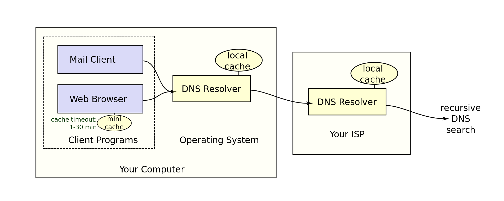
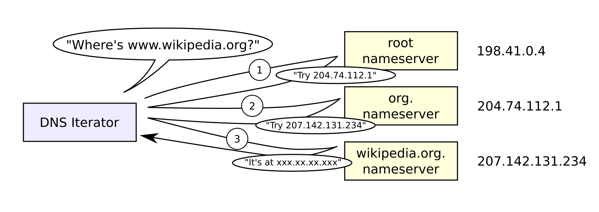

## 什麼是 DNS？Google 有提供的公開的 DNS，對 Google 的好處以及對一般大眾的好處是什麼？
DNS (Domain Name System) 是為了要提供對應的域名的 ip 位置所存在的系統，當瀏覽器和電腦的 Cache 都沒有存要查詢域名的 ip 位置時，就會交由預設的 DNS Server 為 ISP (網際網路服務提供業者) 主機查詢(ex : 中華電信的 168.95.1.1 和 168.95.192.1 )，ISP 的 Cache 也沒有存的話，就會從域名的最右邊開始找。

以域名 `www.wikipedia.org` 為例，DNS Server 先從全球 13 群的 Root name Server 挑一台主機問 `.org` 這類頂級域名的 name server 有哪些；拿到 `.org` name server 們的 ip 位置後， DNS Server 再從中挑一台問 `wikipedia.org` 的 name server 們的 ip 位置；得到後再向其中一個主機問 `www.wikipedia.org` 的 ip 位置，便能得到最終要的 ip 位置，DNS Server 就把此 IP 位置傳回瀏覽器使用。

Google 有提供 IP 位置為 8.8.8.8 和 8.8.4.4 免費供大家使用。當人們都使用此 DNS Server 使 Google 便能得到哪些網站被瀏覽幾次的數據，進而使用這些數據可改善 Google 自家的 SEO 。大眾在使用 Google 搜尋時搜出來排名高的網頁也就可能會比較有用。

## 什麼是資料庫的 lock？為什麼我們需要 lock？
Lock 的目的是在多使用者同時操作資料庫的同一個 table 時來避免資料發生錯誤，會把不應該進行的指令先暫停，讓應該進行的指令先順利完成。
Lock 有分為 `shared lock (sharedLock)` 和 `lock for update (lockForUpdate)`，前者其他使用者還可以 `select` 讀取到資料但無法 `update`；後者其他使用者無法 `select` 也無法 `update`。

在交易 (transaction) 時，可能會有多個 session 同時對同一個 row 讀取或修改資料，會造成資料混亂。使用 Lock 後，先進來的 session 會在要操作的 Row 做一個記號，其他 session 在有記號當下只能對該 Row 做規定好的指令，或等該 session 的交易完成記號消失後其他 session 才能繼續自己的指令。這樣才能保持資料的 Consistency 和 Isolation。

## NoSQL 跟 SQL 的差別在哪裡？

   dd| NoSQL | SQL
  ---|----|---|
  名稱　|NoSQL databases (Non-relational Databases) 　　|SQL (Structured Query Language) databases (Relational Databases) |
Schema| 無，用來存結構不固定的資料|有|
資料存儲格式 | 通常為 JSON | 用 data table|
ACID|鬆綁部分 ACID | 嚴格執行
SQL 指令|不可使用 JOIN 等複雜指令 | 

## 資料庫的 ACID 是什麼？
- Atomicity (原子性、不可分割) : transaction 內的 SQL 指令，不是全部成功，就是全部失敗(只有部份成功會 rollback 到完全沒執行的狀態)。
- Consistency (一致性) : transaction 完成後，會維持資料的一致性(錢的總數相同)
- Isolation (隔離性) : 多個 transaction 可以獨立、同時執行，不會互相影響。
- Durability (持久性) : transaction 完成後，修改的結果不會不見。

### 參考資料
- [[網際網路] 認識網址與網域名稱（Domain Name, URL, DNS）](https://pjchender.github.io/2018/06/06/%E7%B6%B2%E9%9A%9B%E7%B6%B2%E8%B7%AF-%E8%AA%8D%E8%AD%98%E7%B6%B2%E5%9D%80%E8%88%87%E7%B6%B2%E5%9F%9F%E5%90%8D%E7%A8%B1%EF%BC%88domain-name-url-dns%EF%BC%89/)
- [DNS 查詢流程](https://ithelp.ithome.com.tw/questions/10149980)
- [MySQL Lock : Table Lock與Row Lock](https://www.mysql.tw/2018/06/mysql-lock-table-lockrow-lock.html)
- [鎖定資料 Lock](https://kejyuntw.gitbooks.io/laravel-5-learning-notes/database/model/database-model-eloquent-lock.html)
- [SQL vs NoSQL: The Differences](https://wiki.kshuang.xyz/doku.php/database:sql_vs_nosql)
- [什麼是 NoSQL？](https://aws.amazon.com/tw/nosql/)